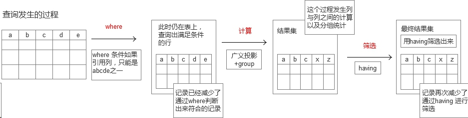
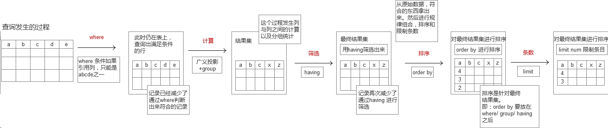
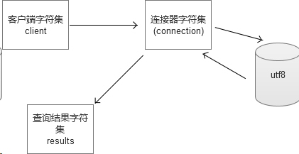

# 数据库概念

一台服务器下有多个库，一个库下有1到多张表，表有多行多列的数据。
postgresql也是一个开源数据库，而且sql标准执行方面，比mysql要严格。

表格  --> 档案袋 --> 人管理(MySql)


# MySql 安装

MySql5.1 & MySql5.5 稳定版


# 基本入门语句

1. 链接数据库
        mysql -uusername -ppassworld
        链接上服务器之后面对的是库。 库有一个或多个.
2. 查看所有数据库
        show databases
        选择库之后，面对的是表。 表有一个表或多个表
3. 创建库
        create database zf [charset utf8]
4. 删除库 
        drop database zf;
        Mysql 表/列可以修改名字，库名字不可以修改.
5. 选择数据库
        use 库名   
            use test 
6. 查看表
        show tables; // 查看库底下有几张表
7. 创建表
        create table stu ( snum int,  sname  varchar(10)  )engine  myisam charset utf8;
8. 删除表
        drop table stu;
9. 改表名
        rename table oldTable to newTable;
10. 清空表
        truncate stu;
        truncate 与 delete 区别:
        truncate 相当于删除表再重建一张同样结构的表，操作之后得到一张全新的表.
        delete 是从删除数据行的层面来操作的，如果有自增的影响还在.
11. 插入数据
        insert into stu values ( 1, 'zhangsan' ), ( 2, 'wangwu' );
12. 查询简单数据
         select * from stu;


# insert增数据详解
查看表结构 desc tablename；

## 增 
insert into 
1. 往哪张表，添加信息(行)。
2. 给哪几列添加值。
3. 分别是什么值。

```mysql
# 创建表
create table class (
	id int primary key auto_increment,
	sname varchar(10) not null default '',
	gender char(1) not null default '',
	company varchar(20) not null default '',
	salary decimal(6,2) not null default 0.00,
	fanbu smallint not null default 0
) engine myisam charset utf8;
```
```mysql
# 插入数据
insert into class (id, sanme, gender, company, salary, fanbu) values (1, '天机老人', '男', 'zf', 9000.00, 200);
```
> 插入所有列
 
如果插入所有的列，则可以不声明待插入的列。
不声明插入的列，则理解为依次插入"所有"列 。
```mysql
insert into class (2, '李寻欢', '男', 'jh', 7000, 130);
```

注意:
id是自增型，插入时不必为其赋值。是错误的，需要对应，添加该值或者null。
列与值必须按一一对应

> 增加多行

```mysql
insert into class (sname, company, salary) values ('刘备', '皇室成员', 15.23), ('孙策', '江东集团', 56.32), ('曹操', '宦官后裔', 88.43)
```
纵横 结合定位， 增加数据。

## 改
update 
修改的是字段，并不是记录。
需要添加的where表达式.
1. 修改那张表
2. 需要改哪几列的值
3. 分别改为什么值
4. 在那些行生效

 where expression , 表达式。
只要where 表达式为真，则该条记录发挥作用。

```mysql
update class set commpany = 'qd' where sname = '刘备' and salary > 5000;
```   
每条记录都有 字段 来约束。 

##  删
删除，就是删除每条记录，不存在删除一条记录中的某几个字段.

1. 要删哪张表的数据
2. 要删除那几条数据 (while + 表达式)

```mysql
delete form class where salary>7000;
```
```mysql
#表中的所有数据删除
delete form class;
```

## 查
select基础查询

查询三要素
1. 查询那张表的数据
2. 查询那些记录
3. 查询那些字段

```mysql
select sname, company, salary from class where id = 2;
```

```mysql
# 暴力查找，所有记录，所有字段 
# * 表示所有记录，表名后不加where条件，则选所有记录，认为 是true。
# 效率低下
select * from class;
```

怎么理解where ?
where 后面的是表达式，表达式为true，则此行被取出

- - - - -

如何建表
如何修改表(增加或减少列)
多表联查
子查询
解决触发器
事务
存储过程
备份恢复


# 建表

**列类型意义**
建表就是一个画表头的过程。从术语上说，建表的过程，是 `定义/声明` 字段的`属性/过程`。

建表和列类型又什么关系 ？
分析: 例如一张A4纸，画一个学生报名表。 A4纸是数据的存储空间，而A4的大小是有限的。
准备预留学号留多宽，给姓名预留多宽，给自我介绍预留多宽。
自然的，姓名如果留的过宽，比如20个字能够存下，但是一般人的姓名，就三四个字 就浪费了。如果预留过窄，导致存不下，更有问题。

建立列的时候，自然是:能够容纳放置的内容，但是又不浪费。

建表的意义: **存储同样的数据，不同的类型，所占用的空间和效率是不一样的**
重点 : 列类型的存储范围与占据的字节关系。

## MySQL三大类型

> 数值型

**整型**    
  	tinyint
    smallint
    mediuint
    int
    bigint 
    
分析 tinyint
	占据字节： 1一个字节
	存储范围：-128 -- 127 (无符号)， 0-255     

```
tinyint 1字节

1个字节 8个位

# 模拟  -- 每个位，只能存储0,1
[][][][][][][][]


0000 0000 ---> 0
1111 1111 ---> 2^8-1=255


计算机为了表述一个数是负数，会把最高位(左侧)的 0/1,当成符号位来看。 如为0， 则是正数，如为1,则是负数

0 0000000
0 1111111 ---> 0-->127(2^7-1)


1 0000000 ---> -128
1 1111111 ---> -127

-127 -- 127


二进制补码的问题

+0，-0 则重复了，浪费了一种存储的可能性。
因此计算机中的负数，不是照着 "后面的绝对值直接乘以-1得到的"，而是补码规则换算的。

 
负数 = 绝对值位 - 128;

1111 1111 ---> -1
1000 0000 ---> -128


因此最终的结果： -128 --> 127

```

1个字节 8个位 0~2^8-1 0~255 /  -2^7 --> +2^7-1

分析： 
2个字节， 16位   0~2^16-1 = 65535
						-2^15 ~ +2^15-1  -- -32768 ~ 32767 
						
对于int型，占字节越多，存储的范围也越大

**int系列的声明时的参数**

tinyint 的参数并验证字节与范围的关系
(M) unsigned zerofill

int系列，不需要特殊说明，默认是有符号。
加 unsigned 表示无符号， 可以影响存储的范围

M 参数 

zerofill：zero零， fill是填充。代表：0填充
M必须是和zerofill 配合使用  
场景： 学号，00001 。 这种是需要补0.

```mysql
alter table class add snum smallint(5) zerofill not null default 0;
insert into class (sname, snum) values ('吕布', 1);
```	

学号会显示成： 00001
为什么会补5位， 因为M为 5.
总结：M表示补0宽度， 和zerofill配合使用才有意义.
如果设置，zerofill ，同时必须是 unsigned参数. 0填充，自动unsigned
	     

	     
**小数(浮点型/定点型)**

	float(D, M)
	decimal(D, M)
	
	M --> 标度。 表示小数的'总位数'
	D --> 精度。 代表小数位(小数点右边的尾数)

float(6, 2) 表示 -9999.99 ~ 9999.99
	
也可以添加 unsinged ，zerofill 参数。	


浮点数占多大的空间呢?
float 能存储 10^38 。小数点右边可以精确到： 10^38分之一
如果：M<=24 占4个字节存储，否则占用8个字节存储。 

浮点和定点区别：
定点(decimal)是把整数部分和小数部分，分开存储的。比 float精确. 
float 有时候会损失精度


> 字符串型

char, varchar, text, blod

char(6) 定长字符串。
例如， 姓名 char(6)
查找行记录时，如果都是定长，完全可以通过行数与行的长度计算出来，文件指针的偏移量.
对于定长N，不论是否够不够指定长度，实际都占据N个长度。如果不够N个长度，用空格在末尾补至N个长度。
利用率中，char(),可能达到100%;
char型，如果不够M个字符，内部用空格补齐，取出时再把右侧空格删除掉。（注意：如果右侧本身有空格，将会丢失）


varchar(100) 变长类型。 能够存储0-100个字符。
每个字符都要读取前缀，就算是空字符串，都是需要存储空间。
varchar(N),不用空格补齐，但是列内容前，有1-2个字节来标志该列的内容长度。
利用率中，varchar() 不可能达到100%;


注意：char(M),varchar(M) 限制的是字符，不是字节。
即：char(2) charset utf-8; 能存储 2个utf8 的字符.
 
错误认识：既然是字符，6个utf8字符串，18个字节。 
并不是18个字节。能够存储6个字符，就是在utf8中能够存储6个字节


text 文本类型，可以存储比较大的文本段，搜索速度稍慢。
text 不用加默认值 (加了也没有用)

```mysql
create table test ( article text );
```


blod , 二进制类型，用来存储图像，音频等二进制信息。
意义：二进制， 0-255 每个字节都有可能出现。
blod类型，在于防止因为字符集的问题，导致信息丢失。 
比如：一张图片中有 0xFF 字节， 这个在ascii字符集中，在入库的时候被过滤了。 因为当再次取出的时候，被损坏了。
如果是二进制，那么给你什么东西，你就存储什么东西，并不需要考虑字符集问题。
 

> 日期/时间类型

date, time, datetime, year

date 日期， date 类型 能存储哪年到哪年 ? 
1000-01-01 ~ 9999-12-31

time 时间，time 时间类型 
专款专用，专列专用

datetime 日期时间， 占8个字节

year 年类型  只占1字节，最多能够存储256中变化。
范围：1901 - 2155 ，还有一种 是：0000

```mysql
create table test5 (thing varchar(20) not null default '', ya year  not null default '0000') engine myisam charset utf8;
```


# 网站建表及优化意识

** 社交平台 **

主键 id, 用户名, 性别, 体重KG, 生日, 收入, 上次登陆时间, 个人简介     

```mysql
create table user (
	u_id int unsinged PRI,
	user varchar(20) not null default '',
	sex char(1) not null default '',
	wieght tinyint unsinged not null,
	birth date not null default '00',
	salary decimal(8,2) not null default 0.00,
	lastlogin datetime not null default '0000-00-00 00:00:00 ',
	intro varchar(200) not null default ''
)
```


** 优化 **

分析：这张表除了username intro 列之外，每一列都是定长的。不妨让其所有列都定长，可以极大提高查询速度。

```mysql
create table user (
	u_id int unsinged PRI,
	username char(20) not null default '',
	sex char(1) not null default '',
	wieght tinyint unsinged not null,
	birth date not null default '00',
	salary decimal(8,2) not null default 0.00,
	lastlogin int unsigned not null default '0000-00-00 00:00:00 '
)

create table inrto (
	i_id int unsinged PRI,
	username char(20) not null default '',
	intro varchar(1500) not null default ''
);
``` 

username char(20) 是会造成存储空间的浪费，但是提高了速度，值得。
intro char(1500) 却浪费的太多了，另一方面，人的简介，一旦注册完，修改的频率也并不高。可以把intro列单独拿出来，另放一张表里。
修改完之后，主表全部都是定长，容易被人查看，修改，速度快。
lastlogin 定义成 datetime计算的时候麻烦，一般使用的是，时间戳。


总结：
时间与空间是一对矛盾体。

优化的方法：`时间换空间`, `空间换时间` .

在开发中，会员的信息优化往往是，把频繁用到的信息，优先考虑效率，存储到一张表中。不常用的信息和比较占据空间的信息，优先考虑空间占用，存储到另外一张辅表中。 


```mysql
create table member (
	id int unsigned auto_increment primary key,
	username char(20) not null default '',
	gender char(1) not null default '',
	weight tinyint unsigned not null default 0,
	birth date not null default '0000-00-00',
	salary decimal(8.2) not null default 0.00,
	lastlogin int unsigned not null default 0
) engine myisam charset utf8;

create table inrto (
	i_id int unsinged auto_increment primary key,
	username char(20) not null default '',
	intro varchar(1500) not null default ''
);
```


# 修改表

一张表，创建完毕，有了N列。
之后还有可能要增加或删除或修改列

**新增列**

	alter table 表名 add 列名称 列类型 列参数; [增加在表的最后]
	alter table 表名 add 列名称 列类型 列参数 after; 某列[把新列指定增加到某列后面]

新建一个列在表的最前面，使用`first`
	
	alter table 表名 add 列名称 列类型 列参数 first;
	alter table m1 add pid int not null defalut '' first;

```mysql
alter table m1 add username char(20) not null default '';
alter table m1 add birth date not null default '0000-00-00';
```


**删除列**

alter table 表名 drop 列名;

```mysql
alter table m1 drop pid;
``` 

**修改列**

修改列类型

alter table 表名 modify 列名 新类型 新参数;

```mysql
alter table m1 modify gener char(4) not null default ''; 
```


修改列类型和列名
alter table 表名 change 旧列名 新列名 新类型 新参数

```mysql
alter table m1 change id uid not null auto_increment primary key; 
```
  
如果列类型改变了，导致数据存储不下了怎么处理?
比如：int 修改成 smallint 列. 如果不匹配，数据将会丢失，或者在mysql严格模式下 (strict mode) 下修改不成功.


# ecshop 商品表

``` mysql
# shop
# 分析商品表
# 建立类似的
# 小型表
# 
# 商品表
# 
# goods_id 商品主键
# cat_id 栏目id
# goods_sn 货号
# goods_name 商品名称
# click_count 点击量
# brand_id 品牌
# goods_number 库存量
# goods_weight 重量
# market_price 市场价格
# shop_price 本店价格
# promote_price 优惠价格
# warn_number 报警数量
# keywords 关键字
# goods_thumb 小图
# goods_img 中等图
# original_img 原始图
# is_real 真实商品，与：extension_code 有关，还有虚拟商品
# extension_code  
# is_on_sale 是否上架状态
# is_alone_sale  是否单独销售，赠品
# is_shipping 是否包邮
# integral 送的点数 
# add_time 添加的时间戳
# sort_order 排序的权重
# is_delete 是否删除
# is_best 是否精品
# is_new 是否新品
# is_hot 是否热卖
# is_promote 
# bounts_type_id 优惠券
# last_update 上次修改时间
# goods_type 商品类型
# seller_note 买家备注

# 商品表
# goods_id, cat_id, goods_sn, goods_name, click_count, 
# goods_number, market_price, shop_price, add_time, is_best, is_new, is_hot

# 查看其它 表创建
# show create table 表名 
# show create table ecs_goods; 

CREATE TABLE `goods` (
  `goods_id` mediumint(8) unsigned NOT NULL AUTO_INCREMENT,
  `cat_id` smallint(5) unsigned NOT NULL DEFAULT '0',
  `goods_sn` varchar(60) NOT NULL DEFAULT '',
  `goods_name` varchar(120) NOT NULL DEFAULT '',
  `click_count` int(10) unsigned NOT NULL DEFAULT '0',
  `goods_number` smallint(5) unsigned NOT NULL DEFAULT '0',
  `market_price` decimal(10,2) unsigned NOT NULL DEFAULT '0.00',
  `shop_price` decimal(10,2) unsigned NOT NULL DEFAULT '0.00',
  `add_time` int(10) unsigned NOT NULL DEFAULT '0',
  `is_best` tinyint(1) unsigned NOT NULL DEFAULT '0',
  `is_new` tinyint(1) unsigned NOT NULL DEFAULT '0',
  `is_hot` tinyint(1) unsigned NOT NULL DEFAULT '0',
  PRIMARY KEY (`goods_id`)
) ENGINE=MyISAM AUTO_INCREMENT=48 DEFAULT CHARSET=utf8


# 导入其它表中的相同字段的数据
# insert into 导入表 select 导入字段 被导入表

insert into zf.goods select goods_id, cat_id, goods_sn, goods_name, click_count, goods_number, market_price, shop_price, add_time, is_best, is_new, is_hot from ec_goods;

```

# SQL查询表达式

**查询练习**

1. 查询商品主键是32的商品

	select goods_id, goods_name, shop_price from goods where goods_id = 32;
	
2. 不属于第三个栏目的所有商品  即cat_id 不等于 3 
	`!=` 等价于 `<>`

	select goods_id, goods_name, shop_price, cat_id from goods where cat_id != 3;
	select goods_id, goods_name, shop_price, cat_id from goods where cat_id <> 3;
	
3. 本店商品价格高于三千的商品	
	
	select goods_id, goods_name, goods_price from goods where goods_price > 3000;
	
4. 本店商品价格小于或等于100的商品
	
	select goods_id, goods_name, shop_price from goods where shop_price<=100;
	
5. 取出第4栏目和第11栏目的商品(不许用or)

	select goods_id, cat_id, goods_name from goods where cat_id in(4, 11);
	
6. 取出100<=价格<=500 的商品(不许用and)

	select goods_id, goods_name, shop_price from goods where shop_price between 100 and 500;

注意：in是 是散的满足。 between 范围的满足.	

7. 取出不在第3个栏目和不在第11个栏目的商品(and或not in 分别实现) 。 即栏目的id，是3的不要，是11的也不要。 
	// $cat_id !=3 && $cat_id != 11;

	select goods_id, goods_name, shop_price, cat_id from goods where cat_id not in(3, 11);
	select goods_id, goods_name, shop_price, cat_id from goods where cat_id != 3 and cat_id != 11;
	
8. 取出价格大于100且小于300，或者大于4000且小于5000的商品 
	在[100, 300] 之间，或者 是 [4000,5000]
			
	select goods_id, goods_name, shop_price, cat_id from goods where (shop_price>100 and shop_price<300) or (shop_price>4000 and shop_price<5000);
	  	 	
and 的优先级比 or 高

9. 取出第3个栏目下面价格 < 1000 或 > 3000, 并且点击量 >5 的系列商品
	
	select goods_id, goods_name, shop_price, cat_id, click_count from goods where cat_id = 3 and ( shop_price < 1000 or shop_price>3000 ) and click_count >= 5;	
	 	
怎么要求就怎么写

10. 取出1号栏目下的商品 (无限级分类) 大分类 --> 小分类 --> 小分类 。。。
	
	select goods_id, goods_name, cat_id from goods where cat_id = 1;
	
11. 取出名字以"诺基亚"开头的商品

	select goods_name, shop_price from goods where goos_name like '诺基亚%';
	
`%` 匹配任意字符.

12. 取出已名字"诺基亚N"后面固定的二位字符. 

	select goods_name, goods_id from goods where goods_name link '诺基亚N__';
	
`_` 匹配任意单一字符			


# SQL 查询模型

## select 字句

把列看成变量，把where看成PHP中 if ( exp ) 里的 exp 表达式
哪些行被取出，哪一行能够让表达式为true，那一行就能够取出来。

判断这一行取出什么?
```mysql
select goods_id, goods_name from goods where 1>2;
```
取出为空


把列看成变量。
既然变量，变量之间也是可以运算，可以作为表达式。可以当作参数，作为函数的参数。

取出商品id，商品名，本店价格比市价价格省的钱
```mysql
select goods_id, goods_name, (market_price - shop_price) from goods;
select goods_id, goods_name, (market_price - shop_price) from goods where 1;
```
表中原本就没有(market_price - shop_price) 的列
这一列其实是一个运算结果，术语叫"广义投影". 理解成字段运算.

列的运算结果，可以当成列看，还可以起个列别名。 (伪列)

```mysql
select goods_id, goods_name, (market_price - shop_price) as discount from goods where cat_id!=3;
```
-----

查出本店价比市场省的钱，而且省200以上的商品.

```mysql
select goods_id, goods_name, (market_price - shop_price) as discount from goods where (market_price - shop_price) > 200;


select goods_id, goods_name, (market_price - shop_price) as discount from goods where discount > 200; # 报错
# where 后面不能使用别名。

# where 查询 --> 结果 (多行多列的二维结构)

# where 查询的结果是对 表 中的数据发挥作用， 查询出数据。
# discount 是在结果中数据算出. 
# where发挥作用时，表上并没有discount列。发挥完作用，形成的结果里才能discount。 
# 对于结果中的列，如果再想筛选需用使用having

# where 字句就没有discount列，所以报错.
```

where 条件是表达式，在哪一行表达式为真，哪一行就取出来。


题目：
把num的值处于[20, 29]之间的，改为20
num值处于[30, 39] 之间的，改为30

```mysql
create table number ( num smallint not null default 0 ) engine myisam charset utf8;

inset into number values (3), (12), (23), (25), (29), (32), (34), (38);

update number set num = floor(num / 10) * 10 where num>=20 and num<=30;
# 字段看成变量，可以运算，可以使用函数，可以做成表达式.
   
```

## group 子句

**统计函数**

max: 求最大。min: 求最小。sum: 求总和。avg: 求平均。count: 求总行数。

1. 查出最贵的商品的价格

```mysql
select max(shop_price) from goods;  
```

2. 查处最便宜的商品的价格

```mysql
select min(shop_price) from goods;
```

3. 查询出发布最早的商品。即goods_id 最小的值.

```mysql
select min(goods_id) from goods;
``` 
 
4. goods_number 是指库存量，统计一下，本店一共库存多少件商品

```mysql
select sum(goods_number) from goods;
``` 

5. 查看一个店中的所有商品的平均价格.

```mysql
select avg(shop_price) from goods;
```

6. 统计一下本店中有多少的商品。(不是多少个)
 
count 计算 多少条记录.
如果使用字段，来count()计算总共，null并不会计算在其中.

```mysql
select count(*) from goods; # 查询的就是绝对的行数，哪怕某一行所有字段全为null，也计算在内。
select count(goods_id) from goods; # 字段如果是 null，并不会计算在其中。
```

用 count(*)，count(1)，谁更好呢?
对于myisam引擎的表，没有区别的。因为，这中引擎内部，有一个计数器在维护着行数。
innodb的表，用count(*)直接读取行数，效率低下，因为innodb真的去数一边。


5个统计函数，单独使用，意义不大，要和分组配合起来使用，威力更大。


计算，第3个栏目下所有商品的库存量之和  sum(goods_num);

```mysql
select sum(goods_number)  from goods where cat_id = 3;  
```

计算，第4个栏目下所有商品的库存量之和 
```mysql
select sum(goods_number) from goods where cat_id = 4;
```


**group 子句**

计算，一次计算完，每个栏目下的库存量之和
按照规则，分组，然后 组内解决总和。

分组之后再统计，结合起来使用。

```mysql
select sum(goods_number) from goods group by cat_id;
```

-----

是否正确：
```mysql
select goods_id, sum(goods_number) from goods;
```
这条语句执行了，把 goods_id，第一次出现的值 取出来。
对于SQL标准来说，这个语句是错误的，不能执行的。但是在MySQL中可以这么做。(MySQL特征)
这是MySQL的一个特点，出于可移植性和规范性，不推荐这样写。
严格的讲，select 的a, b 列必须在 group by  a, b, c的列出现。


按cat_id分组，计算每个栏目下的商品的平均价格
```mysql
select goods_id, cat_id, avg(shop_price) from goods group by cat_id;
```
	

## having 子句
	
**having筛选**

having 发挥的时间，是where对硬盘上的表文件进行查询之后，内存形成一张结果的虚拟表(伪列存在于此表中)， having在此时生效。

1. 查询本店价比市场价省的钱，并且要求省钱200元以上的取出来。

```mysql
select goods_id, market_price, shop_price, (market_price - shop_price) as discount from goods having discount > 200;
# where 没有写出，表示where 1;
```
2. 查询每种商品所积压的贷款(提示: 库存 +单价)
goods_number + shop_price

```mysql
select goods_id, goods_number, shop_price , (goods_number * shop_price) as hk from goods ;
```

3. 查询该店积压的总货款。
	即，每个商品积压的贷款之和。考虑：sum那个列?

```mysql
select sum(shop_price * goods_number) as zhk from goods;
```			

4. 查询每个栏目下，积压的货款。

```mysql
select cat_id, shop_price, goods_number, sum(shop_price * goods_number) as hk from goods group by cat_id;
```

5. 查询积压货款超过2w元的栏目，以及该栏目积压的贷款。

```mysql
select cat_id, shop_price, goods_number, sum(shop_price * goods_number) as hk from goods group by cat_id having hk > 20000;
```

6. 查询本店价比市场价省的钱，且筛选出省钱200以上的商品. (用where 和 having 分别来实现)

```mysql
#where
select goods_id, market_price, shop_price from goods where (market_price - shop_price) > 200;

#having
select goods_id, market_price, shop_price from goods having (market_price - shop_price) > 200;
select goods_id, market_price, shop_price, (market_price - shop_price) as discount from goods having discount > 200;
```

-----

查询出2门及2门以上的不及格者的平均成绩

```mysql		
CREATE TABLE `reslute` (
  `name` varchar(20) DEFAULT NULL,
  `subject` varchar(20) DEFAULT NULL,
  `score` tinyint(4) DEFAULT NULL
) ENGINE=MyISAM DEFAULT CHARSET=utf8

insert into reslute values ('zhangsan', 'math', 90), ('zhangsan', 'ch', 50), ('zhangsan', 'dili', 40), ('lisi', 'ch', 55), ('lisi', 'zhengzhi', 45), ('wangwu', 'zhengzhi', 30);
```

错误
```mysql
select name, avg(score), count(score < 60) as sc from reslute group by name having sc >= 2;
```

正确查询
```mysql
# 1: 查询所有的平均分
select name, avg(score) from reslute group by name;

# 2: 想办法计算出每个人挂科的情况
select name, subject, score, score<60 as g from reslute;

# 3: 挂科数目，就是g 列的 sum() 结果.
# 总和下
select name, avg(score), sum(score < 60) as sc from reslute group by name having sc >= 2;
```



## order by 与 limit 
**order by**
语法: `order by 列名 desc/asc`. (列名，结果集中的列名)    
例如:  `order by add_time asc` . 按发布时间升序排列.

1. 取出第4个栏目下的商品，并按价格由高到低排序。
```mysql
select goods_id, goods_name, shop_price from goods where cat_id = 4 order by shop_price desc;
```

2. 按栏目升序排列，同一个栏目下的商品，再按商品的价格降序排列
```mysql
select goods_id,cat_id, goods_name, shop_price from goods order by cat_id asc, shop_price desc;
# 多个字段排序，通过`,` 逗号隔开。
```
**limit**
限制条目
`limit 数量` 限制条数
`limit [offset] N` 
offset 偏移量 (可选参数),跳过几行。 N 取出条数。
offset 如果不写则相当于 `limit  0 N`； offset 是跳过的个数，N是实际取的个数。

1. 本店商品价格最高的商品。
```mysql
select goods_id, goods_name, shop_price from goods order by shop_price limit 3;
```
2. 本店最高的第三名到第五名 商品。
```mysql
select goods_id, goods_name, shop_price from goods order by shop_price desc limit 2,3;
# 取第3到第5，即意味着跳过， 第1，第2, 因此偏移量offset是2.
# 取第3,4,5条。即取3条，因此N=3；
```

3. 取出价格最高的那条商品
```mysql
select goods_id, goods_name, shop_price from goods order by shop_price desc limit 1;
```

4. 查询出每个栏目下id号最大(最新)的一条商品.

```
# 错误语句分析
第一种错误：group by cat_id;
group by cat_id 从语义上来分析，select 的列，只能是cat_id, max/min/avg/sum/count .
这个 goods_id, goods_name 从语义上分析就不对，也不符合sql标准。
只是MySQL允许这种语法。
取出 栏目中 第一次 出现的记录。

第二种错误：name 匹配第一次出现的
select max(goods_id) as max_cat_id, goods_id, goods_name from goods group by cat_id;

第三种错误：先 order by 再 group by. 语法错误。
select goods_id, cat_id, goods_name from goods order by cat_id asc, goods_id desc;
在此基础上，再分组。
select goods_id, cat_id, goods_name from goods order by cat_id asc, goods_id desc group by cat_id;

需要使用到 子查询.
```




# 子查询

## where 型子查询
把内层查询的结果，作为外层查询的比较条件
典型的：查询最大商品，最贵商品。

如果 where 列 = (内层 sql)。 则内层sql返回的必然是单行单列.
如果 where 列 in (内层 sql)。 则内层sql返回单列， 可以多行。

1. 查询出本店最新的(goods_id最大) 的一条商品。

```mysql
# 思路，按照goods_id desc 排序，再去 第一行.
select goods_id, goods_name from goods order by goods_id desc limit 1;
```

2.  查询出本店最新的(goods_id最大) 的一条商品。要求不要使用排序.

```mysql
# 思路，求出最大的id， 然后在where判断
select goods_id, goods_name from goods where goods_id = (select max(goods_id) from goods);
```

查询出每个栏目下id号最大(最新)的一条商品.
```
# 第一步：查询出每个栏目下goods_id 最大的。
select max(goods_id) from goods group by cat_id;
# 只需要再把goods_id = 第一步值.
select goods_name, goods_id from goods where goods_id in (select max(goods_id) from goods group by cat_id);
```

## from 型子查询
内层sql的查询结果，当成一张临时表，供外层sql再次查询.

查询模型：查询结果集 ---> 在结构上可以当成表看.


查询出每个栏目下id号最大(最新)的一条商品.

```mysql
select * from (select goods_id, cat_id, goods_name from goods
order by cat_id asc, goods_id desc) as tmp group by cat_id;
```

## exists型子查询

把外层sql的结果，拿到内层sql去测试。
如果内层的sql成立，则该行取出。

查询有商品的栏目.取 栏目标，且只取下面有商品的栏目
思考：什么样的表，叫做 下面栏目有商品?
设某栏目cat_id 为N,则 select * from goods where cat_id = N;
能取出数据，则说明该栏目有商品 

```mysql
select cat_id, cat_name from category where exists (select * from goods where goods.cat_id = category.cat_id);
# 从外层SQL取出内层SQL需要的字段值，然后再通过内层SQL来判断.
```

## 奇怪的NULL

建表时，列后面 not null defalut ''/default 0; 这是什么意思
就是让这个列值不为NULL， 如果某个列确实没填，也有默认值，值不为NULL 

为什么列的值不为NULL。


```mysql
create table test5 ( sname varchar(20) ) engine myisam charset utf8;

insert into test5 values ('tianjilaoren'), ('lixunhuan'), ('afei'), NULL;

# 查询出用户名不为null的行

select * from test5 where sname != null;

# tianjilaoren lixunhuan afei 没有查询出来?

#查询 sname 为null 的行

select * from test5 whre sname = null;

#也是空

select 'afei' = null; # 查询结果： NULL

# NULL为家， list=null 是假

select null = null; #查询结果： NULL

# null = null , 还是 null， 还是假

select null != null; #查询结果：NULL

# null是空

# null 的比较需要用特殊的运算符 is null 和 is not null

select * from test5 where sname is not null;

# 取出值为null

select * from test5 where sname is null;
```


null 是一种类型，比较时，只能用专门的is null 和 is not null 来比较 碰到运算符， 一律返回 null.
效率不高，不利于提高索引效率。

因此，往往在建表的时候声明 `not null default ''/defalut 0`


# 新手1+N模式

新手1+N模式查询

```php
$conn = mysql_connect('localhost', 'root', '');

$sql = 'use zf';

mysql_query($sql, $conn);

$sql = 'set names utf8';

mysql_query($sql, $conn);

$sql = 'select goods_name, cat_id, goods_number, shop_price from goods';

$rs = mysql_query($sql, $conn);

$list = array();
while ( $row = mysql_fetch_assoc($rs) ) {

	/**
	 * 根据$row 中的cat_id 在此查询category表
	 * 每循环一次，又要查询另一张表
	 * 因此，查询 1+N 次.
	 */
	$sql = 'select cat_name from category where cat_id = ' . $row['cat_id'];
	
	$rs2 = mysql_query($sql, $conn);
	
	$cat = mysql_fetch_assoc($rs2);
	
	$row['cat_name'] = $cat['cat_name'];
	
	$list[] = $row;
	
}
```

# 左链接&右链接

## 两表全连接查询

**集合知识**

集合的特点： 无序性 ， 唯一性
集合的运算：求交集，求并集，笛卡尔积(相乘)

笛卡尔积，即集合的元素，做两两的组合。


**表与集合的关系**

一张表就是一个集合
每一行就是一个元素.

集合不能重复，但可能有两行数据完全一样。
MySQL内部每一行，还有一个rowid.

-----

场景：
```mysql
create table test7 ( id int, name varchar(20) ) engine myisam charset utf8;
create table test8 ( cat_id int, cat_name varchar(20) ) engine myisam charset utf8;

insert into test7 values (1, '桃子'), (2, '苹果'), (3, '梨');
insert into test8 values (95, '月亮'), (96, '星星');
```

在数据库的操作上，如何操作表，完成集合的笛卡尔积的效果。
直接使用","隔开表名，查询即可。

```mysql
select * from test7,test8;
```

两表做全相乘
从行的角度来看：就是2表每一行，两两组合
从列的角度来看：结果集中的列，是两表的列名的相加


做全相乘

```mysql
create table minigoods like select * from goods;

select goods_id, minigoods minigoods.cat_id, goods_name, category.cat_id, cat_name from minigoods,category;

# 全相乘
# 加了条件之后
select goods_id, minigoods minigoods.cat_id, goods_name, category.cat_id, cat_name from minigoods,category where minigoods.cat_id = category.cat_id;

```

## 左连接语法及应用

Mysql 优化：索引优化, 字段优化, 存储引擎优化 (索引是发生在查询过程中)

假设A表在左，B表在A表的右边滑动。
A表与B表通过一个关系来筛选B表的行

语法： `A left join B on 条件`
条件为true，则B表对应的行，取出.

`A left join B on 条件` 这一块形成的也是一个结果集,也可以看成一张表。 可以对 `A left join B on 条件` as C 。可以对C表做查询， 自然where, group, having, order by, limit 照常使用。 还可以继续 left join. `A left join B on 条件 left join D on 条件`

C 表的可以查询的列有哪些列 ?
A,B 的列都可以查询。


```mysql
select goods_name, goods_number, shop_price, cat_name from goods left join category on goods.cat_id = category.cat_id;
```

## 左右内连接的区别

没有另一张表对应的行，使用NULL补齐。
多行对应，该如何解决。

```mysql
create table boy (
bname varchar(20),
other char(1) 
) engine myisam charset utf8;

insert into boy 
values 
('lin','A'),
('李寻欢','B'),
('阿飞','C'),
('呆鹅','D'),
('Weibo','E'),
('贾宝玉','F');

create table girl (
gname varchar(20),
other char(1)
) engine myisam charset utf8;

insert into girl
values 
('陈志芳','A'),
('飞儿','C'),
('飞飞','C'),
('石头','D');
```
- - - - -

```mysql
select boy.*, girl.* from boy left join girl on boy.other = girl.other;
```

结果：

| bname     | other | gname       | other  |
| ------    | -----:| -----:      | :-----:|
| lin       | A     | chenzhifang | A      |
| lixunhuan | B     | NULL        | NULL   |
| afei      | C     | feier       | C      |
| afei      | C     | feifei      | C      |
| daie      | D     | shitou      | D      |
| Weibo     | E     | NULL        | NULL   |
| jiabaoyu  | F     | NULL        | NULL   |

是以boy表, 为基准。


```mysql
select boy.*, girl.* from girl left join on boy.other = girl.other;
```

结果:

| bname | other | gname       | other |
| ----- | ----: | -----:      | :---: |
| lin   | A     | chenzhifang | A     |
| afei  | C     | feier       | C     |
| afei  | C     | feifei      | C     |
| daie  | D     | shitou      | D     |

是以 girl表 为基准


注意：a left join b, 并不是说a表的就一定是在左边，只是说在查询数据时，以a表为准。
NULL,是补齐，而不是查询出来的。


左右连接是可以互换的.
A left join B, 就等价于 B right join A;


```mysql
select boy.*, girl.* from boy right join girl on boy.other = girl.other;
```

注意：左右连接 可以互换， 尽量使用 左链接， 出于移植时兼容性方面考虑。


**内连接的特点**

```
select boy.*, girl.* from boy inner join girl on boy.other = girl.other;
```
两个表中符合条件且都有值，拿出来。

结果：

| bname | other | gname       | other |
| ----- | ----: | -----:      | :---: |
| lin   | A     | chenzhifang | A     |
| afei  | C     | feier       | C     |
| afei  | C     | feifei      | C     |
| daie  | D     | shitou      | D     |


从集合的角度看：
A inner join B 和 left join/right join 的关系：
内连接是左右连接的`交集`


**外连接**

左右连接的并集, 外连接。
但是，在mysql中不支持外连接。


题目：

```mysql
create table m (
mid int,
hid int,
gid int,
mres varchar(10),
matime date
) engine myisam charset utf8;


create table t (
tid int,
tname varchar(20)	
) engine myisam charset utf8;

insert into m 
values 
(1,1,2,'2:0','2006-05-21'),
(2,2,3,'1:2','2006-06-21'),
(3,3,1,'2:5','2006-06-25'),
(4,2,3,'3:2','2006-07-21');


insert into t 
values 
(1,'guoan'),
(2,'shenhua'),
(3,'gongyiliandong');
```

查询 :

```mysql
# 取出出主客队的ID， 并不做特殊处理.
select hid, mres, gid, matime from m;

# 根据hid, 左联t表 ，查出主队的队伍名称
select hid,tname, mres, gid, matime from m left join t on m.hid = t.tid;

# 根据gid， 查出客队的队伍名称.

select hid, tname, mres, tname, gid, tname, matime from 
(m left join t on m.hid = t.tid) left join t on m.gid = t.tid;
# 错误的原因 是 m t t 相连， 名字冲突，起个别名，就可以解决.
# select 列名 as 别名。也可以 .


select hid, t1.tname, mres, gid, t2.tname, matime from 
(m left join t as t1 on m.hid = t1.tid) 
left join t as t2 on m.gid = t2.tid;

# 最后拼接结果：
select hid, t1.tname, mres, gid, t2.tname, matime from
(m left join t as t1 on m.hid = t1.tid)
left join t as t2 on m.hid = t2.tid
where matime > '2006-06-01' and matime < '2016-07-01';

#三表联查 + where.

# 第二种方法：使用 inner join 
select hid, t1.tname, mres, gid, t2.tname, matime from m inner join t as
t1 on m.hid = t1.tid inner join t as t2 on m.gid = t2.tid where matime > '2006-0
6-01' and matime < '2016-07-01';

``` 

# 查询完成ecshop留言板

PHP 逻辑来完成留言板查询

```mysql
header('Content-type: text/html; charset=utf-8');

/**
 * 商城留言板
 * 
 * 一般情况下，做留言板的显示很容易。
 * 直接select 查询，再显示出来。
 * 
 * 但是ecshop中的留言板难点在于
 * 留言条数来自于2张表。
 * feedback 留言表
 * comment 评论表
 * 
 * 需要把两张表中的数据都取出来，显示结果。
 */
 
/**
 * 思路：从业务逻辑层，用PHP来解决问题
 * 1. 先取出feedback 表，循环取出数据，放入一个数组
 * 2. 再取出comment 表，循环取出数据，放入一个数组
 * 3. 取出的两个数组合并
 * 4. 循环合并后的数组
 */ 

$counn = mysql_connect('localhost', 'root', '');

$sql = 'use ecshop';
mysql_query($sql, $counn);	
 
$sql = 'set names utf8';
mysql_query($sql, $counn);

// 取出feedback表中数据
$sql = 'select user_name, msg_content, msg_time from ecs_feedback where msg_status = 1';

$feeds = array();
$rs =	mysql_query($sql, $counn);

while ( $row = mysql_fetch_assoc($rs) ) {
	
	$feeds[] = $row; 
	
}

// 取出comment表中数据
$sql = 'select user_name, content as msg_content, add_time as msg_time from ecs_comment where status = 1';
$rs = mysql_query($sql, $counn);

$comm = array();
while ( $row = mysql_fetch_assoc($rs) ) {
	
	$comm[] = $row;
			
}

$all = array_merge($feeds, $comm);

```

## union用法深入讲解

union : 合并 2 条 或多条语句的结果.

语法：sql1 union sql2;


1. 查询出价格低于100元 和 价格高于4000元的商品.(不能使用 or)

```mysql
# 先查询<100的商品
select goods_id, goods_name, shop_price from goods where shop_price < 100;

# 查询 > 4000 的商品
select goods_id, goods_name, shop_price from goods where shop_price > 4000;

# 使用，union  联合查询 、

select goods_id, goods_name, shop_price from goods where shop_price < 100 union select goods_id, goods_name, shop_price from goods where shop_price > 4000;

```

* 能否从2张表查询在union呢?
union 合并的是 '结果集'，不区分来自于那一张表。

取自于2张表，通过别名让2个结果集的列一致。
那么，如果取出的结果集，列名字不一样，还能否union。
可以使用 union，而且取出的最终列名，以第一条SQL为准.

* union 满足什么条件就可以使用 ?
结果集中的字段数量一致

列的类型不一致，不一样，没关系，也是可以合并的。合并的意义不大。


* union 后的结果集，可否再排序呢?
可以再排序。 sql1 union sql2 order by 字段;
```mysql
select goods_id, goods_name, shop_price from goods where shop_price < 100 union select goods_id, goods_name, shop_price from goods where shop_price > 4000 order by shop_price asc;
```

* 用union,取出第4个栏目的商品和第5个栏目的商品，并按价格升序排列.

```mysql
select goods_id, goods_name, shop_price from goods where where cat_id = 4 union select goods_id, goods_name, shop_price from goods where cat_id = 5 order by shop_price asc;	
```

* 使用 order by 的注意事项

sql 语句中的 desc 没有发挥作用.

外层的语句还要对最终结果，再次排序。因此，内层的语句的排序，就没有意义。
因此: 内层的order by 语句单独使用， 不会影响结果集，仅排序。在执行期间，就被MySQL的代码分析器优化。
内层的order by 必须能够影响结果集时，才有意义。 比如 配合 limit 使用。
根据是否影响结果集，选择性优化。

* 第3个栏目下，价格前3高的商品 和 第4个栏目下， 价格前2 高的商品。(使用union完成)

```mysql
(select goods_id, cat_id, goods_name, shop_price from goods where cat_id = 3 order by shop_price asc limit 3)
union
(select goods_id, cat_id, goods_name, shop_price from goods where cat_id = 4 order by shop_price asc limit 2);
```

内层的order by 发挥了作用， 因为有 limit。order by 会实际影响结果集，有意义。


* 如果 union后的结果有重复(即某2行，或N行， 所有的列，值都一样),如何变化。

这种情况下，是比较常见的，默认会去重复。

如果不想去重复。
可以使用 union all;


**union 面试题**
懒，能写一行绝不写二行。

```mysql
CREATE TABLE `num1` (
  `id` varchar(10) DEFAULT NULL,
  `num` int(11) DEFAULT NULL
) ENGINE=MyISAM DEFAULT CHARSET=utf8;


CREATE TABLE `num2` (
  `id` varchar(10) DEFAULT NULL,
  `num` int(11) DEFAULT NULL
) ENGINE=MyISAM DEFAULT CHARSET=utf8;


insert into num1 values ('a', 5), ('b', 10), ('c',15), ('d', 10);

insert into num2 values ('b', 5), ('c', 15), ('d', 20), ('e', 99);

```
------
```mysql
# 查询
select id, sum(num) from (select * from num1 union all select * from num2) as tmp order by id;
```

# 数学函数与字符串函数

[MySQL函数](http://wiki.jikexueyuan.com/project/mysql/useful-functions/string-functions.html)

**数学函数**
sqrt(); 计算指定数字的平方根
rand(); 生成随机数


**聚合函数**

avg(col); 返回指定列的平均值
count(col); 返回指定列中非null值的个数
min(col); 返回指定列的最小值
max(col); 返回指定列的最大值
sum(col); 返回指定列的所有值之和
group_concat(col); 返回由属于一组的列值连接组合而成的结果


 
**字符串函数**

ascii(); 计算字符的ascii码
length(col); 计算字符串的字节长度 
char_length(col); 计算字符数
reverse(col); 字符串反转
position('@' in 'abc@sina.com') 返回字符串位置
right('abc@sina.com', 8); 返回 后边的 字符串

```mysql
create table test14 (uname varchar(20), email varchar(30))engine myisam charset utf8;
inesrt into test14 values ('lily', 'lily@163.com'), ('zhifang', 'zhifang@qq.com');
select email, right( email, length(email) - position('@' in email) ) from test14;

# 对于email，并非全部的存储一个字段，而是分开存储了，变得更加高效。
# 把 email拆成 @ 前后2部分，放在2个列。
```


## 时间函数与流程控制函数

**时间函数**

now(); 返回 年月日时分秒
curdate(); 返回 年月日
curtime(); 返回 时分秒
dayofweek('2016-09-18'); 查看某一天，是那一周的第几天 . (西方的周日第一天).
week( curdate() );   查看某一年的第几周. 38 

```mysql
create table jiaban (
num int,
dt date	
)engine myisam charset utf8;

insert into jiaban 
values
(5, '2012-09-01'),
(6, '2012-09-02'),
(7, '2012-09-03'),
(8, '2012-09-04'),
(9, '2012-09-05'),
(10, '2012-09-06'),
(11, '2012-09-07'),
(12, '2012-09-08'),
(13, '2012-09-09'),
(14, '2012-09-10'),
(15, '2012-09-11'),
(16, '2012-09-12');

# 按周统计加班时间

select sum(num), week(dt) as wk from jiaban group by wk;

```

**加密函数**

md5(); md5加密，不可逆，单向加密，不可逆。

良好的加密：
1， 不可逆性
2. 碰撞性低 （重复的概率低）


**控制流程函数**

case 值 when 某种可能 then 返回值 when 另一种可能值 then 返回值 else 默认值 end

```mysql
select sname, case gender when 1 then '男' when 0 then '女' end as xingbie from test15;
```

if ( 条件, '', '' ); 三元运算符 

```
select sanme, if (gender=0, '优先', '等待') as vip from test15;
```

ifnull(expr1, epxr2); 判断第一个表达是否为null，如为null， 返回第2个表达式的值; 如不为null，返回自身，即表达式1.

```mysql
ifnull(null, 0);
ifnull('',0);
```

## 系统调试函数

user(); 返回用户即所在主机 , 判断自己的身份
database(); 当前所在的库
version(); 服务器版本 , 服务器比较古老，某些兼容性问题，需要判断。


## MySQL函数使用注意事项 

PHP中和MySQL中都有相同的函数，那么优先使用哪种?

1. MySQL的函数肯定是要影响查询速度.
应该在建表的时候，通过合理的表结构减少函数的使用。 比如：emial, 按 @ 前后拆分。

2. 如果确实需要使用函数。 
比如时间的格式化， 在 mysql里用date_format, 在php里用date可以实现。
优先放在业务逻辑层，即PHP层处理。

3. 在查询时使用了函数，最大的一个坏处。
以 date_format(A); 则A列的索引将无法使用。

如果针对某些查询，而此列，用上了函数来判断。
此列将不再使用索引。

例如：select name, email from table where right('@', length(email) - position('@' in email) );
email 列使用索引，可以加快查询速度。
但因为使用的并不是email列，而是函数处理后的email的返回值。 
因此，email列的查询就 非常缓慢。

总结：在where条件中，对某列的使用了函数，由此列的索引不发挥作用。


# 视图 VIEW

在查询中，经常把查询结果 当成临时表来看。
View是什么? View 可以看一张虚拟表。是表通过某种运算得到的一个投影(映射)。
View 没有实实在在的数据，只是通过表，经过一系列的运算，运算出来的一个结果。

表的变化，会影响到视图。


查询每个栏目下，商品的平均价格,并取平均价前3高的栏目

```mysql
select avg(shop_price) as pj, cat_id from goods group by cat_id order by pj desc limit 3;
```
group by cat_id,查询出每个栏目下的平均价，设为结果集A。无论是查询前3高，还是前3低，都要用到结果集A。结果集A频繁使用，因此可以把结果保存一张表，下次来查这张表。但是，如果goods表又添加了商品，A结果集就与保存的临时表不一样了，不会单项更新数据，这时，可以用视图解决。


**创建视图**
建视图的，要指定视图的列名与列类型么?
不需要，它是个影子，继承了上面的字段。 只是一种关系。


既然视图只是表的某种查询的投影，所以主要的步骤在于查询表上，查询的结果命名为视图就可以了。

**创建视图的语法**
create view 视图名 as select 语句;


视图的作用：
1. 可以简化查询. 
比如:复杂的统计时，先用视图审查一个中间结果，在查询视图。
2. 更精细的权限控制。
比如:某张用户表为例。 2个网站搞合作，可以查询对方网站的用户.
需要向对方开发用户表的权限，但是呢，又不想开放用户表中的密码字段。创建一个视图，除去密码字段。

```mysql
create view vuser
as
select user_id, username, emial from user;

开放这个视图的权限给对方。

3. 数据多，分表时可以用到。
比如：小说站 novel 表， 1000多万篇。(一张表放200万数据，大概)
可以分成 novel1, novel2, novel3 ... 直到放完。每张表放200万。
查询小说时，不知在哪张表。

```mysql
create view novel as 
select title from novel1 union select title from novel2 ... union title from 最后一张表;
```

视图是表的一个影子。
表与视图，数据变化时的相互影响问题

表的数据变化，要影响到视图的变化。

视图如果变化了，表如何变?
视图某种情况下，也是可以修改的
要求：视图的数据和表的数据 一一对应。 就像函数的映射才行。
表--> 退出视图的对应的数据
视图-->推出表对应的数据

视图往往是用来查询。

视图的定义，是一直存在的，视图并没有占用空间。

`.frm` 表结构 定义文件
`.MYD` 表的数据
`.MYI` 表的索引

删除视图

```mysql
drop view gui;
```

一一对应是指：根据select关系，从表中取出的行，只能计算出视图中确定的一行。反之，视图中任意抽一行，能够反推出表中的确定一行。


## 视图algorithm

```mysql
cretae view v1
as
select * from goods where shop_price>300;
```

下次查询价格>300 且小于500

```mysql
select * from v1 where shop_price<500;


select * from goods where shop_price > 300 and shop_price < 500;
```

把建视图时的条件 和 查视图的条件 叠加起来， 直接去查表。

对于一些简单视图，在发挥作用的过程中，并没有建立临时表，而只是 把条件存起来，下次来查询，把条件一合并，直接去查表。


条件叠加相比于建临时表，那个快。
建表：查询->形成临时表->查询临时表

叠加：合并条件->查询表


需要建立临时表么，还是合并语句。

algorigthm作用就是是否需要合并条件查询语句

algorigthm=merge (合并查询语句)
temptable 临时表
undefined 未定义，由系统判断

```mysql
create algorithm = merge view v2
as 
select * from goods where shop_price > 300;

select goods_id, goods_name, shop_price from v2 from where shop_price < 500;
```
v2视图，并没有建立临时表
有时候，在复杂查询下，必须建立临时表。
比如，每个栏目的平均价格。
```mysql
create view v3 as select *  from goods order by cat_id asc, shop_price desc;
```
下次再查，每个栏目最高的商品价格
```mysql
select * from v3 group by cat_id;
```
思考：如何合并这两个语句。

合并后，语句 出错了.
此时，语句不能合并，只能先建立临时表。

```mysql
create algorithm=temptable view v3 as
select goods_id, cat_id, goods_name, shop_price from goods order by cat_id asc, shop_price desc;
```
这张表，明确指定了生成临时表。
如果拿不准用什么，或者不愿意考虑。alogrithm=undefind .让系统做决定.

对于简单查询使用 alogrihtm=merge


# GB2312与UTF8编码

**字符集**

计算机中，只有 01010101
而人的世界中，有文字，有图片，有声音。

01 ----> 文字对应起来

认为的约定
65-->A
66-->B
...

二进制编码 到 字符的映射，就是字符集


**ASSIC**

1个字节8个位，就足够。实际上ASSIC ，使用7个位表示就足够。
0-127来表示
0xxx xxxx 来表示。最高位始终是0

gb2312 --> gbk
汉字2个字节
碰到>128的，就再往后找一字节，2个字节理解成中文。
继续找，找到>128,就带一个字节。<127 一个字节表示。


解决了多字节之后，又引来一个问题--世界各国的字符集，兼容问题。

**Uincode**
Unicode是一个世界通用的码表

unicode 与 utf-8 的关系?
unicode 是 4个字节存储。
unicode 只负责分配编号，而不负责在网络上传输，需要经过一定的规则进行简化。
转换格式：UTF。
压缩方式：UTF-8。

就像原文件 --> 压缩文件的关系

给定unicode字符 --> uft-8 的二进制值.
utf-8的二进制值 --> unicode字符。解码与编码问题.

utf8占用几个字节呢?
不可能定长，压缩规则才有效果。 1-6个字节. 


GBK中文经常在java中，被转为utf-8，如何转?
GBK和 unicode有对应关系

GBK->unicode->utf-8


**乱码如何形成的?**

1. 解码时，与实际编码不一致，`可修复`。
2. 传输过程中，编码不一致，导致字节丢失`不可修复`。


# MySQL字符集参数

**set names作用**

客户端的字符集，设为A GBK
数据库的字符集设为B UTF8(建表的时候设置的编码)

客户端收集到是什么编码 和 服务器想存成什么编码.


连接器的特性：链接客户端与服务器
客户端的字符先发给连接器，连接器选择一种编码将其转换，临时存储。
再次转换成，服务器需要的编码




clientGBK --> 转connUTF8, connUTF8-->不转换，服务器UTF8
clientGBK --->GBK不转给连接器， connGBK ， 转connUTF8 -->	服务器UTF8

**设置阶段编码**

要想不乱码，需要指定客户端的编码，让连接器不理解错误。这样就不会存入错误数据。往回去的时候，还要告诉连接器，如果从服务器返回数据，应该转成什么格式。

一共3个参数:
* 客户端发送的编码
* 连接器使用的编码
* 获取的返回数据的编码

需要明确告知服务器，客户端编码:
```mysql
set character_set_client = gbk;
```
告诉连接器使用utf8
```mysql
set character_set_connection = utf8;
```
告诉服务器返回结果使用GBK
```mysql
set character_set_reslutes=gbk;
```

如果服务器设置严格，不允许插入。不严格，插入会造成数据丢失。

收到客户端编码 和 往服务器送， 两个过程.

gb2312 < gbk < utf8

sever >= conntion >= client 

如果3者都是 GBK，可以简写。简写成 `set names gbk`


牵涉到数据库，不乱码
1. 正确指定客户端的编码
2. 合理选择连接器的编码
3. 正确指定返回内容编码
4. 网页文件本身编码
5. mate 信息编码. 


## utf8的BOM问题

一个中文在UTF8下是三个字节

记事本在打开的时候，分辨不出来要使用什么编码解析。
分析编码的特点，推测出来使用什么编码。

如果字节比较少，容易推测错误。

在utf8的BOM，是3个字节一个中文。

utf8文件的时候，前面多了三个字节：EF BB BF。
这3个字节不用来显示，是用来辨识utf8。是BOM信息。

在session cookie 使用前，不能有任何输出，空行空格都不行。
在utf8有BOM头的信息下，多个三个字节。会在session 或 cookie 会出现错误。


utf8和utf-8什么区别?
utf-8是一种编码，世界上utf-8只有一个。

表达这个编码方式. UTF-8 utf-8 utf8 UTF8。都是指选用utf-8这种方式。名称不一样，别名。推荐UTF 大写。

## 中文截取无乱码

```php
<?php

/**
 * utf8截取无乱码
 * 
 * 思路：
 * 看到如下字节
 * 42 DC 34 af aa
 * 
 * 想截取无乱码，那就说明，从 42开始截几个字符，作为一个字符。
 * 
 * 从第一个字节开始，需要知道截取几个字符，比如截取1个字节，截取取出42
 * 
 * 再从DC截取，需要知道，从DC往后是几个字节组成一个字符。
 * ...
 * 
 * 类推，这样，截取出来的字节才能保证，正是是一个个的字符。
 * 关键如何判断utf8的字符的字节数。
 * 有几个 1
 * 
 * 最高字节 
 * 0xxx xxxx 1个字节
 * 110x	xxxx 2个字节
 * 1110 xxxx 3个字节
 * 1111 0xxx 4个字节
 * ... 
 * 111111100  	 
 */
 
 $str = '中文英E文中Z国M,M美国';
 
/**
 * $str 是带截取的字符串
 * $len 是截取的字符数
 */ 
function utf8sub ( $str, $len ) {
	
	// 处理空字符
	if ( $len <= 0 ) {
		return '';
	}

	$length = strlen($str); // 待截取的字符串字节数	
	
	// 先字符串的第一个字节, substr(); 是按照字节来截取  ord();转为 ansiic码
	
	$offset = 0; // 截取高位字符的偏移量
	$chars = 0; // 截取到的字符数
	$reslut = ''; // 截取到的字符串
	
	while ( $chars < $str && $offset < $length ) {
		
		$high = decbin(ord(substr($str, $offsetc, 1))); // 11100100 判断高位字节
		
		if ( strlen($high) < 8 ) {
			
			// 截取一个字节
			$count = 1;
			
		} else if ( substr($high, 0, 3) == '110' ) {
			
			// 截取两个字节
			$count = 2;
			
		} else if ( substr($high, 0, 4) == '1110' ) {
			
			// 截取三个字节
			$count = 3;
			
		} else if ( substr($high, 0, 5) == '11110' ) {
			
			// 截取四个字节
			$count = 4;
			
		} else if ( substr($high, 0, 6) == '111110' ) {
			
			// 截取五个字节
			$count = 5;
			
		} else if ( substr($high, 0, 7) == '1111110' ) {
		
			// 截取六个字节
			$count = 6;	
					
		}
		
		$reslut .= substr($str, $offset, $count);
			
		$chars += 1;
		$offset += $count;
		
	}
	
	return $res;
	
} 

echo utf8sub($str, 5);

// 使用字符串来判断，效果不高.

?>
```

# 存储引擎与事务简单介绍

**mysql引擎**

例子：
一份歌词，保存方式。
可以怎么保存。

1. 记载脑子里，
2. 用铅笔写纸上
3. 用钢笔写
4. 刻石头上

美国科学家，收集了人类的音乐，符号。(二泉映月)


不变的是数据，变化的是"存储的格式"


如果说有：
sanme,age
三 22
四 23

这个信息，无论用什么engine来存储，都一样。
但是，不同engine，都有存储信息功能，则必须不一样的地方。


总结：engine 引擎，就是mysql存储数据的不同方式。

数据库对同样的数据，有着不同的存储方式和管理方式，在mysql中，称为存储引擎。


**事务**

```mysql
# 建立2张一样结构的表，但是引擎不一样
create table a1 ( uname varchar(20), money int ) engine myisam charset utf8;
create table a2 ( uname varchar(29), money int ) engine innodb charset utf8;

insert into a1 values ('zhangsan', 3000), ('lisi', 2000);
insert into a2 values ('zhangsan', 3000), ('lisi', 2000);

# 在存储数据上是一样的。
```

银行转账

张三给李四转500元

张三 -500
李四 +500

这2步，必须都完成了，转账才完成。

想这种，2步或n步，从逻辑上来讲，是一个“原子操作”
即，要么成功，要么都不成功。

如何保障这种特性。
使用事务. 在这种环境下诞生的一个概念，操作。

事务特性：原子性，一致性，隔离性，持久性。

原子性就是：2步或N步操作，逻辑上不可分割。
通俗说，要么成功，要么都不成功。


```mysql
# 如何使用事务?
# strat transaction; 开启事务。
# ... 中间事务操作 
# commit; 提交事务

# 原子性
strat transaction;

update a1 set money = money + 1000 where uname = 'zhangsan';
update a2 set moneys = money - 1000 where uname = 'lisi'; # 失败, 故意表名打错，模拟网络故障等失败场景。

# 整体的转账操作，从逻辑上讲，应该失败，即zhangsan的钱，不能多500
# 部分失败，则之前的成功操作，如何处理。
# 回滚 
rollback;

```
-----

```mysql
# 一致性
# 是指操作前后，值的变化，逻辑上成立。

```
-----

```mysql
# 隔离性
事务结束前，每一步的操作带来的影响，别的会话看不见。

```
-----

```mysql
# 持久性
事务一旦完成，无法撤销

```

电子商城，在线支付.

支付成功，生成一条支付流水。
同时，把订单改为已支付。(事务，一致性)


数据库的使用者：
增删改查，左右连接，子查询。


数据库的设计者：
建库/建表的数据库设计。

引擎优化，索引优化，表的范式设计，主从服务器


数据库的管理者
DBA
权限管理，数据备份，运行监控，性能检测。
