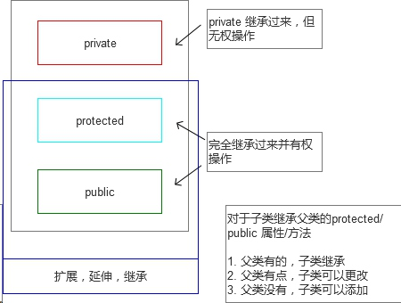

# 面向对象

面向对象的概念及哲学


面向过程：
程序中，对可能性的判断，都被详细的讨论到，并未每一种可能准备相应的操作。

以往的分析：

* 收到什么数据
* 做什么判断
* 各自再怎么做处理.


面向对象：
造一个对象，并不管对象和对象之间的关系。

Person
属性[名字]
功能/方法[动词]


# 类与对象的概念

类：就是所有对象的共同点的一个抽象。
就是一个--制造说明书。
对象：就是根据说明书造出来的具体对象。


从对象中抽象出来：
属性(有什么)(名词) -- 变量
功能/方法(能干什么)(动词) -- 函数

{N个属性 + N个方法} 打包 成一个 “东西” --> 对象
N个变量，N个函数，打包到某个对象里。
这个对象可以使用N个变量，N个函数。


语法：
```php
/**
 * 语法
 * class 类名 {}
 */

class People {

	public $name = 'lod boy';

	public function cry () {

		echo 'kung Fu';

	}

}

$p = new People();

$p->cry(); 

echo '<br />',$p->name;

```

# 属性与方法的注意点

**声明类时注意到事项**

关于属性值，可以声明属性并赋值，也可以声明属性，并不赋值. 如果不赋值则属性的初始值是`null`


关于PHP中的类，注意，属性必须是一个“直接的值”
是8中类型任意的"值"。
不能是表达式, 不能是函数的返回值，不能是计算结果。 


PHP函数中不能重复定义.
但是，类中的方法，可以理解“包在类范围内的函数”
和全局的函数不是一回事，因此，可以重名，不会冲突（两个和平相处，相安无事）。


总结：
属性，只能是直接量，不能是表达式的元算结果或函数返回值。也可以不为属性赋值，则为`null`
方法，方法被包在类中，与外部的函数无关，可以重名，不冲突。

**创建对象时到底发生了什么**

先按类的声明，把属性凑齐，再返回该对象。

1：申请内存，生成对象(属性集合)。
2：如果有构造函数，则执行。
3：返回该对象地址。


# 构造函数

**构造函数**

作用：给类添加动态生命。为对象成员变量赋初始值

同一个模板，不同的对象，这就是一对矛盾。

构造函数的作用时机：
每当new一个对象，就会自动新new出来的对象执行该构造函数。


步骤：先按类的声明，把属性凑齐。再用`__construct`去影响属性。再返回该对象。


**析构函数**
对象销毁的时候，自动执行

对象如何销毁？

1. 显示的销毁，`unset`,`赋值null`,`去掉引用`
2. PHP是脚本语言，在代码执行到最后一行，所有申请的内存都要释放掉，自然对象的那段内存也要被释放，对象也要被销毁。


**对象的回收机制**

对象默认是引用传值

对象的销毁是指`object`的销毁，就想一间房子推平一样。$a,$b,$c,$d 就像指向这间的钥匙。

unset(); 是把指针给切断.

`object`销毁才会执行`__destruct()`


# this绑定

当一个对象调用其方法时，该方法执行之前，先完成一个绑定。 **`$this` --> 绑定到调用此方法的对象**
静态不绑定`$this`对象

`$this`是一个伪对象

方法体内想访问调用者的属性,必须使用$this 如果不加，则理解为方法内部的一个局部变量。

$this指向调用方法的对象。

# 封装概念

public 
private		

对于一个对象，对外界开放一个接口，调用接口时，内部进行的操作，不需要让外界知道，隐藏了内部多一些实现细节。


# private权限控制

权限修饰符
作用：用来说明 属性/方法的权限特点

三个权限修饰符
private 私有的
protected 保护的
public 公共的


public 修饰的属性或方法可以在那儿访问?
private 修饰的属性或方法可以在那儿访问?


如何判断属性/方法 有没有权限访问?
看访问时的位置。

public 的属性，在任意位置都可以访问。
private 的属性/方法，只能在类定义的大括号内，才能访问。


private权限控制
只能在类的 `{}` 内调用，走出了`{}`，谁也调用不到.


**权限控制的bug**

PHP在实现上，并不是以对象为单位来控制权限，而是以类为单位，来控制权限。类内，类外。

```mysql
<?php

	class Human {
		
		private $money = 1000;
		
		public function getMoney ( $people ) {
			
			return $people->money;
			
		}
		
		public function setMoney ( $people ) {
			
			$people->money = 500;
			
		}
		
	}
	
	$lin = new Human();
	$zf = new Human();
	
//	echo $lin->money;

	echo $lin->getMoney($zf);
	
	$lin->setMoney($zf);
	
	echo $lin->getMoney($zf);	
	
?>
```

为什么以类为单位?
因为 类声明一次，而对象却可能非常多。以类为单位，简单了判断模型。

zend 引擎 
ce == EG(scope)
调用者属性的类 与 执行上下文所属的类 是否相等


从面向对象的角度来考虑，写法就不应该把一个对象，直接传递给一个方法来使用。

总结：
应该尽量的来调用对象的方法，而不应该直接把对象当成参数传递过去。


## MySQL类封装

目标：
连接数据库
发送查询
对于select型 返回查询数据
关闭mysql连接

首先得连接，连接就得有参数。怎么通过参数传递过去。
1. 配置文件 （建议使用第一种）
2. 通过构造函数传参


```php
<?php

	class Mysql {
		
		private $host;
		private $user;
		private $pwd;
		private $dbName;
		private $charset;
		
		private $conn; // 保存服务器连接资源
		
		public function __construct() {
		
			// 读取配置文件，根据配置文件，来设置私有属性
			$this->host = '127.0.0.1';
			$this->user = 'root';
			$this->pwd = '';
			$this->dbName = 'zf';
			
			// 连接
			$this->connect($this->host, $this->user, $this->pwd);	
			
			// 切换库
			$this->switchDb($this->dbName);
			
			// 设置字符集
			$this->setChar($this->charset);
			
		}
		
		/*
		 *	连接 
		 */
		private function connect( $h, $u, $p ) {
			
			
			$conn = mysql_connect($h, $u, $p);
			
			$this->conn = $conn;
			
		}
		
		/**
		 * 切换数据库
		 */
		 public function switchDb( $db ) {
		 	
			$sql = 'use '. $db;
			
			$this->query($sql);
			
		 }
		 
		 /**
		  * 设置字符集
		  */
		public function setChar( $char ) {
			
			$sql = 'set names'. $char;
			
			$this->query($sql);
			
		}  
		
		/**
		 * 发送sql查询
		 */
		public function query( $sql ) {
			
			return mysql_query($sql, $this->conn);
			
		}
		
		/**
		 * 获取多行多列select结果
		 */
		 public function getAll( $sql ) {
			
			$list = array();
			
			$rs = $this->query($sql);
			
			if ( !$rs ) {
				return false;
			}		
			
			while ( $row = mysql_fetch_assoc($rs) ) {
				$list[] = $row;
			}			
		 	
			return $list;
			
		 }
		
		/**
		 * 获取一条记录的select 结果
		 */
		public function getRow( $sql ) {
			
			$rs = $this->query($sql);
			
			if ( !$rs ) {
				return false;
			}
			
			return mysql_fetch_assoc($rs);
			
		} 
		
		/**
		 * 获取一个单个值
		 */
		public function getOne( $sql ) {
			
			$rs = $this->query($sql);
			
			if ( !$rs ) {
				return false;
			}
			
			$row = mysql_fetch_row($rs);
			
			return $row[0];
			
		} 
		
		/**
		 * 关闭资源
		 */
		public function close() {
			
			mysql_close($this->conn);
			
		}
		
	}
	
	echo '<pre>';

	$mysql = new Mysql();
	
	print_r($mysql);
	
	$sql = "insert into t values (7, 'tingzi')";
	
	if ( $a = $mysql->query($sql) ) {
		echo 'query ok';
	} else {
		echo 'no';
	}

	$sql = "select * from stu";
	$arr = $mysql->getAll($sql);
	
	print_r($arr);

	
	// 查询单个
	$sql = "select * from t where tid = 5";
	
	print_r($mysql->getRow($sql));
	
	// 查询共有
	$sql = "select count(*) from t";
	
	print_r($mysql->getOne($sql));


/**
 * 给定一个数组，数组键 -> 列， 数组值->列的值
 * 
 * 然后自动生成insert 语句
 */
 
?>
```

封装概念：
通过权限修饰符，把某些属性封装在类内部，并通过指定的公共接口来访问。
调用某个公共方法时，该公共方法可能调用在内部多个方法。
但是调用者不需要知道内部的调用过程。

private与public
如何区分：
调用私有private 属性/方法的那句话，发生在类的`{}`内，还是类`{}`外。


# 继承

继承：以一个类为父类，另一个类可以作为其子类，子类在继承父类的属性/方法的基础上，进一步增添或修改。

语法：
子类 extends 父类 {
	
}

注意点：子类 只能继承字自 一个父类。
不能这样写:
subClass extends Dog, Cat, Pig {} // 报错


继承了那些东西？
子类可以做什么扩充？
构造函数如何继承的？
私有函数/方法如何继承的?

# 私有属性的继承

对于子类继承父类的protected/public 属性/方法
1. 父类有的，子类继承
2. 父类有点，子类可以更改
3. 父类没有，子类可以添加



**继承范围**

继承时，继承来protected/public 属性/方法，完全继承过来，属性子类。

继承来,父类的 private属性/方法。但是不能操作，(不能读写)

```php
<?php

class Human {
	
	private $wife = '小甜甜';
	
	public function cry() {
		echo '555<br/>';
	}
	
	public function pShow() {
		echo $this->wife,'<br />'; // parent::pShow(); 中的 $this 中的 wife 有两个， 考虑执行上下文，只能获取到本类中。
	}
	
}

class Stu extends Human {
	private $wife = 123;
	public $height = 180;
	
	public function subTell() {
		parent::pShow();
		echo $this->wife, '<br />';
	}
	
}

$li = new Stu();

$li->subTell();

?>
```

# 公共及保护属性和方法的继承

子类继承父类的属性/方法，可以修改或增加。

继承过来的环境是: `protected/public`
父类有的，继承过来，
继承过来，可以修改/覆盖。
父类没有的，可以添加。


**继承时的权限变化**

继承自父类的属性或方法权限只能越来越宽松或不变，但是不能越来越严格

```php
<?php
	class Human {
		public function cry() {
			echo '111<br/>';
		}
	}
	
	class Stu extends Human {
		
		protected function cry() {
			
			echo '595959 <br />';
			
		}
		 
	}
	
	/**
	 * 报错
	 */
	// 子类的cry比父类的cry方法，权限要严格，会报错。
	// 继承时，权限只能越来越宽松或不变，并不能越来越严格。 
	
?>
```

# 构造方法的继承

构造方法也是可以继承的，而且继承的原则和普通方法一样。
如果子类也声明构造函数，则父类的构造函数，被覆盖了。
如果父类构造函数被覆盖了，自然只执行，子类中的新的构造函数.

```
<?php

	class Human {
		public function __construct() {
			echo '呱呱坠地';
		}
	}

	class Stu extends Human {
		
	}

	class Lawer extends Human {
		public function __construct() {
			echo 'king';
		}
	}
	
	$ming = new Stu();
	
?>
```


问题：
如果是一个数据库类，或者model类。
肯定是要继承过去再使用，不能直接操做model类。
而model类的构造函数，又做了许多初始化工作。

重写的model类的构造函数之后，导致初始化工作完成不了。
如果：子类继承时，子类有构造函数，需要手动调用一次父类的构造函数: `parent::__construct`

```php
<?php
	class Mysql {
		
		protected $con = NULL;
		
		public function __construct() {
			$this->con = mysql_connect('localhost', 'root', '');
		}
		
		public function query( $sql ) {
			return mysql_query($sql, $this->con);
		}
		
	}
	
	class MyDb extends Mysql {
		
		public function __construct() {
			// 如果子类继承时，有构造函数，保险一点
			parent::__construct();
			return true;
			
		}
		
		public function autoInsert() {
			return $this->query('use test');
		} 
		
	}
	
//	$mysql = new Mysql();
//	var_dump($mysql->query('use test'));
	
	$mysql = new MyDb();
	
	var_dump($mysql->autoInsert());
		
?>
```

# 权限控制详解

public_protected_private权限控制详解

继承：
subClass extends parentClass {}

继承的特点：
对于protected/public 类型的属性/方法，完全继承过来，有权重新，调用。

继承过来的属性/方法：
父类有的，子类也有，
父类有点，子类可以改写，
父类没有的，子类可以添加。

对于pricate类型的属性/方法，比较特殊、
可以继承过来，但是有个标记，标记从属父类。
即：在子类中是无权调用继承过来的私有属性/方法的。

构造方法的继承：
构造方法可以继承，
new子类时，如果构造方法继承过来的，当然也是自动执行。
但继承过来，子类重写了，自然执行子类的构造方法。(注意：父类的构造方法不再调用)


**public,protected,private区别**

```
<?php

	class Human {
		
		private $name = 'changzhifang';
		protected $money = 3000;
		public $age = 23;
		public function say() {
			echo $this->money, '--', $this->age;
		}
		
	}

	class Stu extends  Human {
		private $npy = 'lin';
		public function talk() {
			echo $this->money, '--', $this->age;
		}
	}

	
	$zf = new Stu();
	
//	echo $zf->npy; // 类外不能调用private
//	echo $zf->money; // 类外不能调用protected
	echo $zf->age; // public 能够在类外调用
	
	 
?>
```

总结：
public 可以在类外调用，权限宽松，protected和private不能在类外调用。

| privated | protected | public |
| :---: | :-----:| :---: |
| 本类 | Y | Y | Y |
| 子类 | N | Y | Y |
| 外部 | N | N | Y |

PHP中，如果三个修饰符(privated,protected,public)都不写的则理解为public。


# 多态 

强类型语言中的类型检测，过于死板。

```php
<?php

	// 多态
	
	class Light {
		
		/**
		 * 玻璃参数
		 */
		public function ons( $g ) {
			$g->display();
		}
			
	}
	
	class RedGlass {
		public function display() {
			echo 'red light';
		}
	}	
	
	class BuleGlass {
		public function display() {
			echo 'blue light';
		} 
	}
	
	class GreenGlass {
		public function display() {
			echo 'green light';
		}
	}
	
	// 手电筒
	$light = new Light();
	
	// 三块玻璃
	$redGlass = new RedGlass();
	$buleGlass = new BuleGlass();
	$greenGlass = new GreenGlass();
	
	$light->ons($redGlass);
	echo '<hr />';
	$light->ons($buleGlass);
	echo '<hr />';
	$light->ons($greenGlass);

?>
```

PHP是弱类型动态语言。
一个变量，没有类型，装什么数据结构也行。
传什么参数都行。

对于PHP动态语言来说，岂止是多态，简直是变态。

过于灵活，不能这样灵活。不能称之为多态。

控制PHP的灵活程度：
对参数进行控制。

```
<?php

	// 多态
	
	class Light {
		
		// 加一个类名作为参数类型检测
		public function ons(RedGlass $g ) {
			$g->display();
		}
			
	}
	
	class RedGlass {
		public function display() {
			echo 'red light';
		}
	}	
	
	class BuleGlass {
		public function display() {
			echo 'blue light';
		} 
	}
	
	class GreenGlass {
		public function display() {
			echo 'green light';
		}
	}
	
	// 手电筒
	$light = new Light();
	
	$red = new RedGlass();
	
	$blue = new BlueGlass();
	
	$light->ons($red);
	
	$light->ons($blue); // 报错
?>
```

加了类型检测后，会报错。
解决方法： 参数定义为符类型，传其子类型。
哲学：子类是父类.  白马是马，黑马也是马.

开发中是：里氏代换： 原能用父类的场合，都可以用子类来代替。


```
<?php

	// 多态
	
	class Light {
		
		// 加一个类名作为参数类型检测
		public function ons(Glass $g ) {
			$g->display();
		}
			
	}
	
	class Glass {
	}
	
	class RedGlass extends Glass {
		public function display() {
			echo 'red light';
		}
	}	
	
	class BuleGlass extends Glass {
		public function display() {
			echo 'blue light';
		} 
	}
	
	class GreenGlass extends Glass {
		public function display() {
			echo 'green light';
		}
	}
	
	// 手电筒
	$light = new Light();
	
	$red = new RedGlass();
	
	$blue = new BuleGlass();
	
	$light->ons($red);
	
	$light->ons($blue);
	
?>
```

如果按PHP本身的特点，不检测类型，本身就可以说是多态的，甚至变态的。

在PHP5.3以后，引入了对于对象类型的参数检测。
注意 只能检测对象所属的类。

对于PHP来说，限制了其灵活性，达到的多态的效果。


反思多态：
其实就是 只抽象的声明父类，具体的工作由子类对象来完成。
这样，不同的子类对象完成，有不同的特点。


# 静态属性/静态方法

在属性或者方法前，加static修饰，这种称为静态属性/静态方法

从内存角度看：
static属性/方法，存放在类的区域中
普通属性，存放在对象中


**静态属性**

推导：
1. 类声明完毕，该属性就会存在。
2. 类在内存中就一个，因此静态属性就一个。

```
<?php

class Human {
	
	static public $head = 1;
	public function changeHead() {
		Human::$head = 9;
	}
	public function getHead(){
		return Human::$head;
	}
	
	// 没有对象，想访问静态的 $head属性
	
	/**
	 * 普通属性包在对象中， 用 对象->属性名， 来访问.
	 * 
	 * 静态属性放在类中，使用什么来访问。
	 * 使用类来访问
	 */
	 
	 // 静态属性既然存放在类空间内：
	 // 1. 类声明完毕，该属性就已经存在，不需要依赖于对象而访问。
	 // 2. 类在内存中就一个，因此，静态属性就一个。 
	 
}


echo Human::$head; // 当一个对象都没有，静态属性随类申明而存在。


// 静态属性就一个，受影响后，所有的对象，
$m1 = new Human(); // 1
$m1->changeHead();

$m2 = new Human();
$m3 = new Human();

echo $m2->getHead(); // 9
echo $m3->getHead(); // 9

?>
```

**静态方法**

```
static public/protected/privated function t() {
	
}
```

普通方法，存在于类内的，只有1份。
静态方法，存在于类内，只有1份。

区别：
普通对象，需要对象去调用，需要绑定$this。(普通方法，必须要有对象，用对象调用。)
静态方法，不属于那个对象，因此不需要去绑定$this(静态方法，通过类名就可以调动)


**无对象，不使用$this**

非静态方法，是不能由类名静态调用的。PHP中的面向对象检测并不严格，只要该方法没有`$this`，就会转化为静态方法来调用。

但是，在PHP5.3的`strict模式`下，或者PHP5.4的默认级别。都已经对类名静态方法做了提示。

```
<?php

	// 普通方法，存在于类内的，只有1份。
	// 静态方法，存在于类内，只有1份。
	
//	区别：
//	普通对象，需要对象去调用，需要绑定$this。
//	静态方法，不属于那个对象，因此不需要去绑定$this

		error_reporting(E_ALL|E_STRICT);

		class Human {
			
			static public function cry() {
				echo '5555';
			}
			
			public function eat() {
				echo 'ect';
			}
			
		}
	
		Human::cry();
		
		// eat 方法，是非静态方法，应该由对象调用。
		Human::eat();
	
?>
```


类 --> 静态方法  √
类 --> 动态方法(在类中没有`$this`可以，但是不支持这种方式)  X

对象 --> 动态方法 √
对象 --> 静态方法 √


# self_parent讲解

static 修饰的静态属性 与 静态方法。

静态属性: 存储于类空间，类声明完毕即存在，不依赖于对象。(在内存中只有一份)

静态方法(无论静态与否，都是在类空间中，只有一份): 不绑定`$this`


static方法的特点的例子：
```php
<?php

class A {
	public function foo() {
		
		if ( isset($this) ) {
			echo '$this is defined (' . get_class($this) . ') <br/>';
		} else {
			echo '$this is not defined <br/>';
		}
		
	}
}

class B {
	
	public function bar() {
		A::foo();
	}
	
}


$a = new A();
$a->foo(); // true

A::foo(); // false

$b = new B();
$b->bar(); // true  // bar 是普通方法，$b绑定到$this,bar(){ A::foo- 这里是静态调用，不操作$this }
										// $this is defined (B); 

B::bar(); // false

?>
```

**self的用法** 

self： 本类，本身.
parent: 父类

在引入自身的静态属性/静态方法
以及父类的方法时，可以使用到。

用法：
self::$staticProperty;
self::sataticMothed();
parent::$staticProperty;
parent::Mothed();

```php
<?php

	// 使用$this,还是使用parent
	class A {
		public function a1() {
			echo 'this is class function a1()';
		}
		public function a2() {
			echo 'this is class function a2()';
		}
	}
	
	class B extends A {
		public function b1() {
			$this->a1();
		}
		public function b2() {
			parent::a2();
		}
	}
	
	$b = new B();
	$b->b1();
	$b->b2();
	
	// 如果从速度上看，理论上 parent::稍快一点点.
	// 因为在子类寻找a1方法,寻找不到，再去其父类寻找.
	
	// 从面向对象角度看, 继承过来的，就是自己的。
	// $this 更符合面向对象的思想.
	
?>
```

# 单例模式

```
场景：
多人协同开发，都需要调用mysql类的实例。

A:
$mysql = new Mysql();
$mysql->query(); // ...
// 测试通过

B:
$db = new Mysql();
// 测试通过
// ...


代码合并到一起:
$mysql = new Mysql();
$mysql->query(); // ...
$db = new Mysql();


问题：
两个mysql类的实例，
而且，每new一下，还要连接一次数据库。
显然，一个页面，有一个mysql类的实例就够了。
如果限制，让多人开发，无论你怎么操作，只能得到一个对象?

使用单例模式来解决这种状况.


