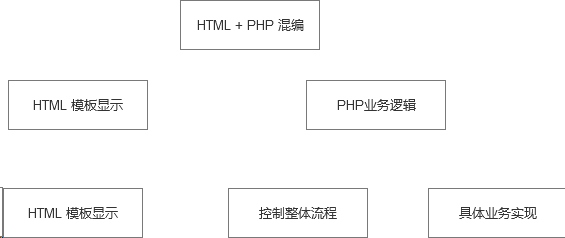

# 框架开发
框架: 只有基础公共代码，而没有业务逻辑的产品，就是框架。
    ThinkPHP, YII, CI....

# MVC
从基本到显示逻辑相分离
需要将显示和逻辑的结果放在一起。 需要在PHP文件中，将HTML代码载入。
HTML页面: 显示格式部分由HTML代码充当，而数据部分需要通过PHP来实现。 数据，特指数据的展示。

模板文件(template): 显示格式由HTML充当，数据部分由动态语言展示。

## 限制访问文件
限制用户访问PHP逻辑文件
典型的两种:
* .htaccess 
    `Deny from All` 利用 Apache的对访问的控制，将某个目录设置成禁止访问。将所有的模板放入到目录内。 
   `.htaccess`生效的前提是，Apache对目录开启了 `Allowoverride All` . 文件载入系统是磁盘文件查找
* 将不允许用户访问的文件，包含模板文件，都放置文档根目录。 浏览器请求只能看到文档根目录下的文件。

## 再次进行代码分离
场景:在完成一个其它页面，在其页面使用到了相同的功能。出现了数据操作逻辑代码的重复功能。
新增专门处理数据的PHP代码 (从原本PHP业务逻辑中代码分离出来: 控制整体流程 和 具体业务实现)

MVC : 软件架构一种分层方式。

